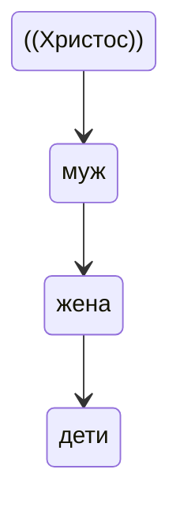

Разработка сайтов (семейных, династических) под ваши запросы, индивидуально. Конструкторы сайтов исключают общение человек — человек, в процессе которого мы помогаем определить цель проекта и то чему он должен служить, выразить главное в виде ограниченного числа слов.

И всё же это конструктор, но в блоками в нём являются целые технологии и подходы, это позволяет решать проблемы которые были решены когда-то до нас. Нам интересно копаться в мире open souce. От брифа до прототипа.

Я новичок в дизайне, но когда есть цель — учиться приятнее и проще.

aСейчас у детей нет способности терпеть свою влюблённость. Есть день святого валентина, надо высказать. Лиза Бричкина любила, но она же до смерти скрывала, не сказала.

«Многодетным семьям выделяются путевки на отдых – и слава Богу, что это делается. Но при этом не предполагается отдых всей семьей…  Речь должна идти либо о компенсациях, либо об организации семейного отдыха. Каждый ребенок – это дар Божий, и многодетность является благословением для родителей». 

Он подчеркнул, что надо уделять внимание воспитанию самих родителей, поддерживать социальные связи многодетных семей как единомышленников, у которых единый образ жизни, для этого «должны создаваться и организации многодетных семей – по крайней мере, в Церкви, а я бы предложил, чтобы такие организации создавались и в нашем обществе. Может быть, где-то это уже есть, но недостаточно для того, чтобы организовать систему солидарной нравственной поддержки – а может быть, не только нравственной, но и материальной – тех, кто попадает в трудную ситуацию, будучи связан большим количеством обязательств по воспитанию детей»^[Выступление Святейшего Патриарха Кирилла на первом заседании Патриаршей комиссии по вопросам семьи и защиты материнства. 6 апреля 2012 г. // Официальный сайт Московского Патриархата. 2005–2021. URL: http://www.patriarchia.ru/db/text/2143731.html (дата обращения: 20.11.2020).].

9.Основой духовно-нравственного становления в православной традиции является воспитание в православной семье, которая, согласно церковному преданию, рассматривается как «малая Церковь». 
Семья устроена иерархически: муж — глава жене, жена — слава мужу, дети находятся в послушании у родителей. 
Семья устроена иерархически: 

Иерархия семейного послушания имеет своим истоком свободное соблюдение Божественных заповедей каждым членом семьи и способствует духовному становлению личности в различные периоды ее развития и раскрытию ее психофизических сил при условии принятия семейной иерархии и нахождения своего места в ней через акт свободной воли каждого члена семьи. Отказ от признания иерархической природы семьи открывает поле действия для сил индивидуализма и себялюбия. Брак несчастен там, где каждый считает себя собственником того, кого любит и стремится установить над другим абсолютную власть. Такая семья не создает почвы для духовно-нравственного становления детей.

[[О фильме ЗА ЖИЗНЬ]] [[personal/Родительская школа/Родительские встречи]]

анти-воспитательный идеал заключается в непослушании взрослым. Испытать мир на прочность. Взрослый (аналог родителя) предупреждает младших об опасности, те с ребяческим задором, соревнуясь друг с другом в превосходстве нарушают запрет. Это приводит к беде, но всё заканчивается хорошо. Все живы, прощены, никто не пострадал, а тот кто предупреждал об опасности, максимум пожурит проказников. Это воспитывает несерьёзное отношение к жизни и к запретам родителей. Удаль преподносится как свобода, которая ведёт к развитию (дети узнают новое, становятся взрослее, приобретают опыт). 

Задача воспитания — поставить серьёзные вопросы перед зрителем. В фильме по повести Патриции Сент-Джон «Следы на снегу» мы видим редкий для детской христианской литературы пример: житейская история рассказана без прикрас, без сюсюканья, без нравоучительных назиданий, без «лобового» нравоучения, чего я терпеть не могу, а дети — тем более. 
— Ольга Колесова,ичлен Санкт-Петербургского Союза журналистов.
Меня удивило, что зло преподносится так, как оно есть: размышляя про ограбление банка, старик говорит, что от его действий пострадало множество людей. Посмотрите и обсудите вместе с родителями фильм и напишите, отзыв: что удивило, что заинтересовало вас.

https://ya.ru/video/preview/2919835778147019455?noreask=1
https://azbyka.ru/fiction/sledy-na-snegu/#ch_0_2

[[personal/markor/Бесы на новый лад]] 

