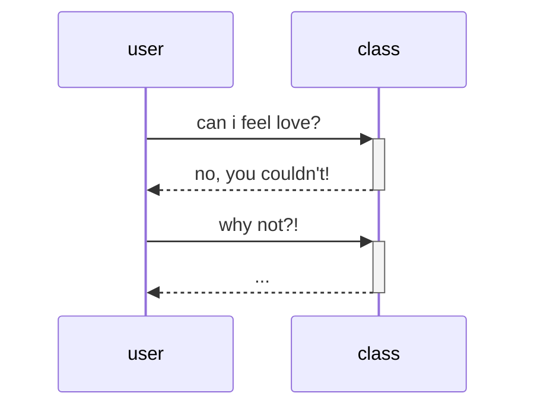

---
tags:
  - проблема
---

- [ ] Телефоны на уроках;
- [ ] Не интересно вести тетради;
- [ ] Отсутствие интереса к выполнению домашнего задания;
- [ ] Неумение выражать мысли;
---
![[Переработка информации.png]]

---
Отличие информации от знания в усилии, которое прилагает человек для того, чтобы сделать его **своим**. Рустам Агамалиев употребляет слово «страдание».

 

