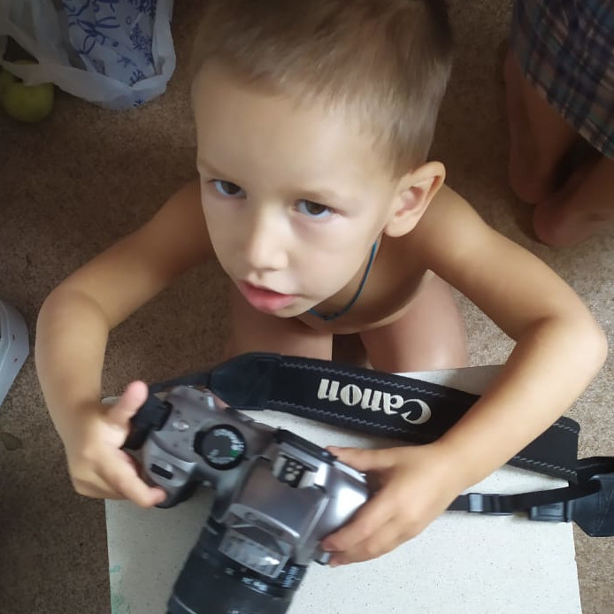

# Добро пожаловать в **Honey**

Этот проект называется **Honey** не случайно.  
Мёд — это и буквально (пчеловодство), и метафора сладкой жизни, которую мы создаём с семьёй.

Здесь три направления:

- 🐝 **Пчеловодство** — заметки об ульях, медоносах и наблюдениях.
- 👨‍👩‍👧‍👦 **Родительская школа** — как мы создаём сообщество семей.
- ☀️ **Дневник радости** — ежедневные записи о том, что принесло улыбку.

## Все записи
Все записи — в одном потоке. Листайте вниз.

<ul>


  <li>
    <b>{{ post.date | date: "%Y-%m-%d" }}</b> — 
    <a href="{{ post.url | relative_url }}">{{ post.title }}</a>
    
      ({{ post.categories | join: ', ' }})
    
  </li>

</ul>


  
Пока нет ни одной записи. Создайте файл в папке _posts/



---

## О проекте

Этот цифровой сад я веду для себя, но буду рад, если он вдохновит кого-то ещё.  
Все заметки написаны от первого лица и отражают мои личные размышления и открытия.